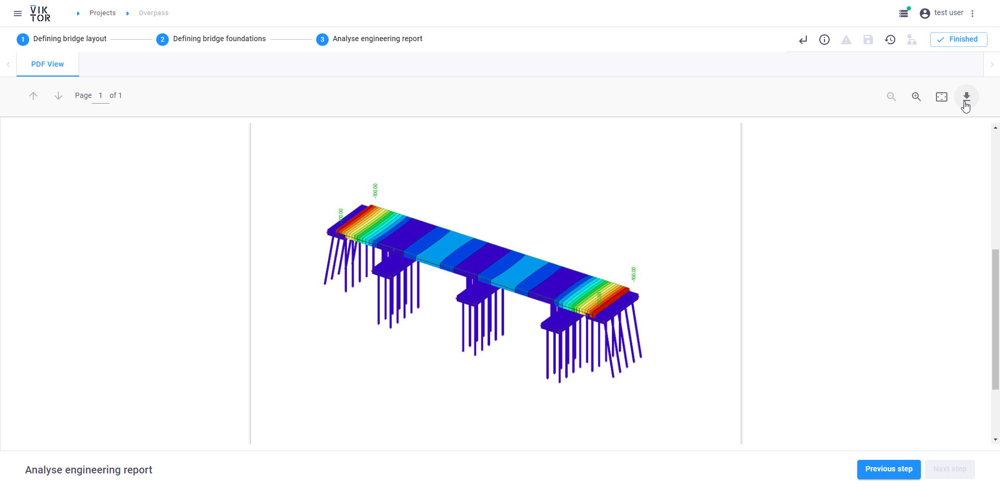

 <Please check version is the same as specified in requirements.txt>

# Sample app parametric bridge design with SCIA 
Use this open-source sample application to parametrically design bridge models through an 
integration with SCIA, without opening the SCIA interface at all. 
The sample app provides a clear visualization of the bridge, and it generates an engineering report in PDF. 
It is also possible to use the functionality within your own Python code.  

## Using the functionality 
There are two ways in which you can use the functionality: 

With VIKTOR, out-of-the-box, using our [free version](https://www.viktor.ai/try-for-free). 

Without VIKTOR, in that case you integrate with your own Python code and create the integration with SCIA yourself. 

This is a snippet of the functionality’s code from app/bridge/controller.py 

In this method the SCIA model is created and an API call is made to the running [worker](https://docs.viktor.ai/docs/worker).
This worker makes a connection to SCIA and generates a engineering report as a PDF file.

**Apply for a [demo account](https://www.viktor.ai/demo-environment) to get access to this and all other VIKTOR sample applications.** 

## Parametric bridge design in 3 steps 

As you can see in the video, the process of parametrically designing a bridge and creating a SCIA model consists of three steps. 
Thanks to the step-functionality, users can better navigate the application, which improves the overall experience of using the app.  

**Defining the layout of the bridge**. 
In this step, you define the length, width, hight, thickness of the deck, 
and number of supports (aligned with number of lanes). 

*Defining the layout of the bridge*

**Defining the bridge foundations**. 
In this step, you define the pile lengths, angles, and width, deck load, and soil stiffness. 
You can also download the .xml, .xml.def, .esa files to use in SCIA.

*Defining the bridge foundations*

**Analyzing the engineering report**. 
In this step, you visualize a 2D model of the geometry with the determined loads automatically in your application from SCIA. 

*Analyzing the engineering report* 

Use the [free version](https://www.viktor.ai/try-for-free) or apply for a [demo account](https://www.viktor.ai/try-for-free) to try the functionality yourself! 
